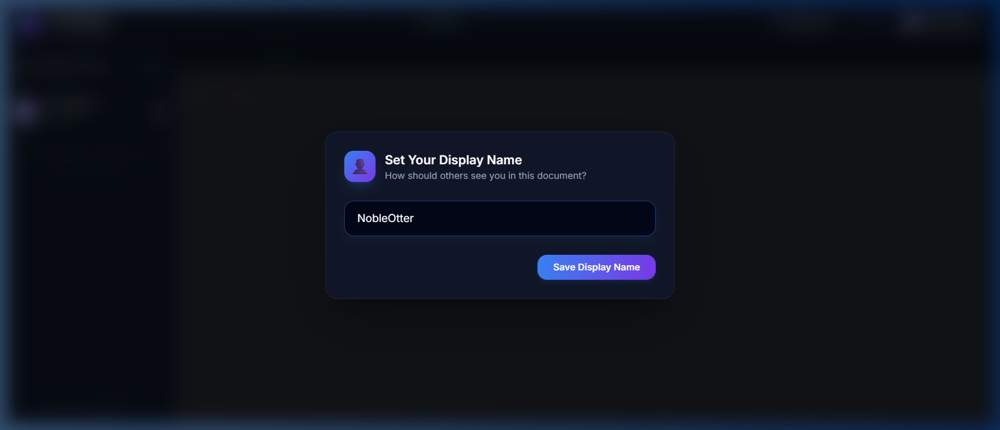
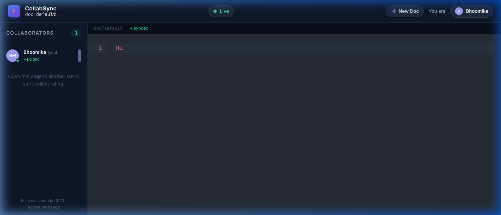
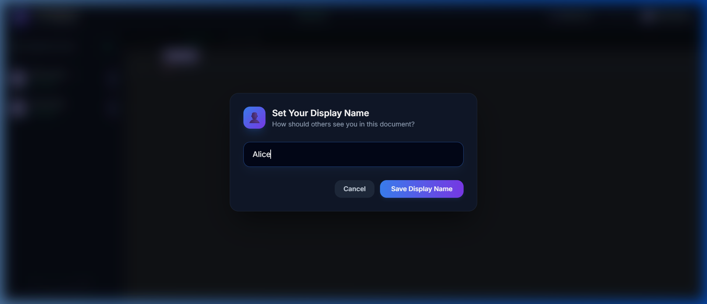
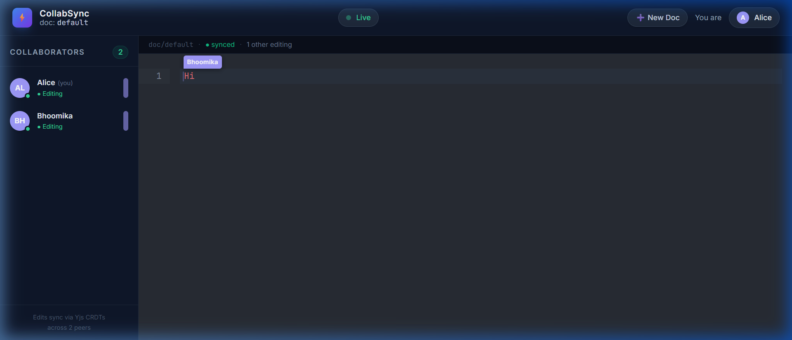
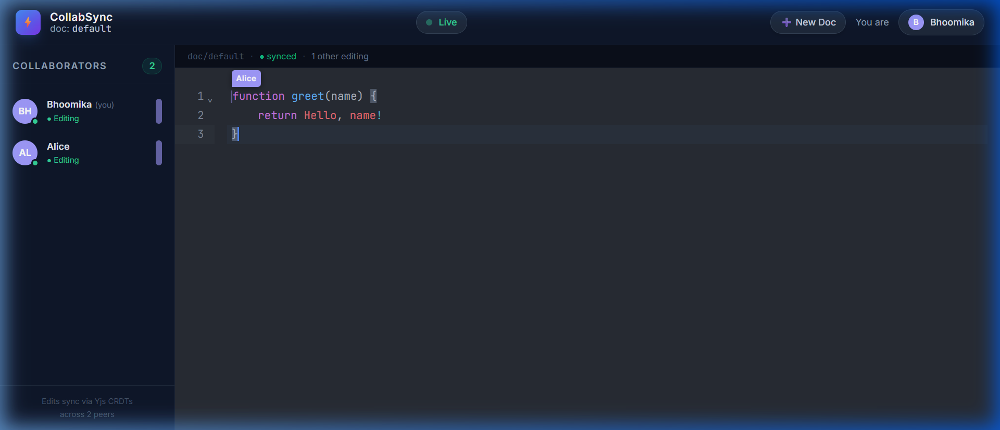
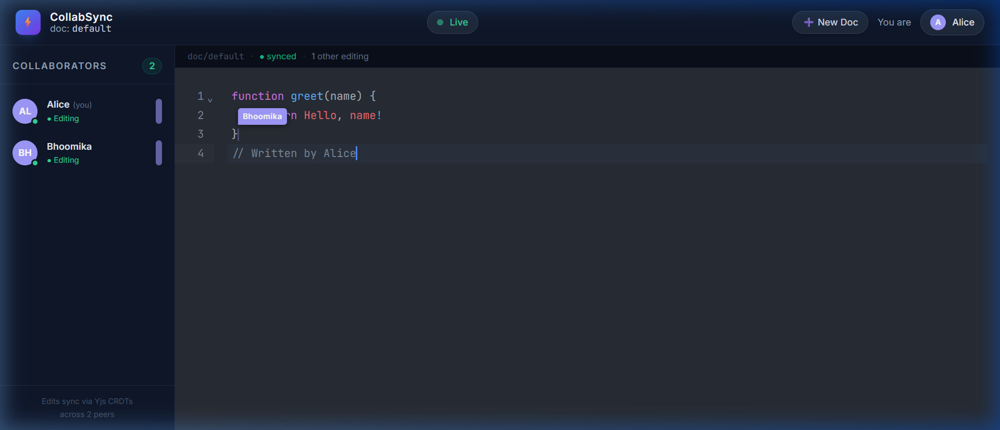
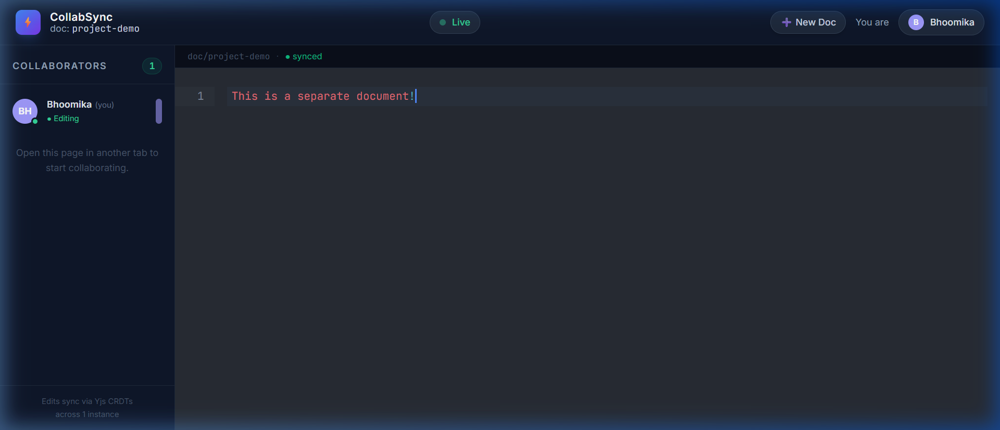

# ⚡ CollabSync (Real-Time Collaborative Code Editor)

## 🚀 Overview

CollabSync is a premium, full-stack real-time collaborative text editor that allows multiple users to write, edit, and collaborate on text documents concurrently. It uses Yjs Conflict-Free Replicated Data Types (CRDTs) to guarantee conflict-free synchronization, backed by Socket.io, Redis for horizontal scaling, MongoDB for durability, and Nginx for load balancing.

---

## 🎬 Demo

> 📹 **[Watch the full demo video on Google Drive](https://drive.google.com/file/d/1xKcxN19UTWdKrqYNR08DANJYdh6Jca8t/view?usp=drive_link)**

---

## 📸 Screenshots

### 1. Display Name Prompt on Load


### 2. Single User Connected (Bhoomika)


### 3. Second User Joins (Alice – Display Name Modal)


### 4. Two Collaborators Active – Cursor Presence Visible


### 5. Bhoomika Typing – Alice's Cursor Visible in Real-Time


### 6. Simultaneous Editing – Both Cursors Shown


### 7. Separate Document Workspace (Multi-Doc Routing)


---

## 🎯 Key Features

- 🔄 **Real-Time Yjs Document Sync**
  - Instant conflict-free synchronization using Yjs CRDTs.
  - Offline edit buffering with smooth reconciliation on reconnect.
- 🎨 **Dynamic Cursor & Selection Highlights**
  - Tracks and highlights active users' exact selection ranges using assigned colors at 15% opacity.
  - Renders custom carets displaying the collaborator's name tag in real-time.
- 👤 **Username Prompt Modal**
  - Blocks the interface on first load to prompt the user for their display name.
  - Allows dynamic profile edits by clicking on the header identity badge, broadcasting updates instantly without socket drops.
- 📍 **URL-Based Multi-Doc Routing**
  - Supports separate document workspaces via dynamic URLs (e.g., `/doc/<doc-id>`).
  - Implements route parsing with dynamic history updates and native back/forward page navigation.
- ⏳ **Bandwidth Optimization**
  - Throttles selection and cursor movement updates to 100ms.
- 🌐 **Horizontal Scaling**
  - Integrates Redis Pub/Sub to sync operations seamlessly across multiple Node server instances.
  - Nginx load balancer handles round-robin distribution and WebSocket protocol upgrades.
- 🐳 **Docker Compose Orchestration**
  - Spin up the entire multi-instance application stack (Redis, Mongo, Nginx, 2 backend servers, and client dev server) using a single command.

---

## 🧠 How It Works

1. **Client interaction**: The user types or selects text in the CodeMirror 6 editor.
2. **CRDT Operations**: Edits are translated to Y.Text binary delta operations. Selection updates are tracked within the Socket.io awareness states.
3. **Upstream Proxy & Load Balancing**: Client traffic hits the Nginx container, which load-balances requests to two independent NodeJS instances.
4. **Redis Bridging**: NodeJS backend instances share state updates across container instances via a Redis message adapter.
5. **Durable Persistence**: Server instances save binary Yjs document snapshots to MongoDB periodically.

---

## 🛠️ Tech Stack

### Frontend
- React.js & TypeScript
- CodeMirror 6 (Editor UI, State, View)
- Yjs (CRDT engine)
- Socket.io Client
- Tailwind CSS (Styling)

### Backend
- Node.js & Express
- Socket.io (Signaling & Presence)
- Redis Adapter (Instance pub-sub bridging)

### Database & Cache
- MongoDB (Mongoose snapshot storage)
- Redis (Fast Pub/Sub broker)

### Infrastructure & Orchestration
- Nginx (Reverse proxy / Load balancer)
- Docker & Docker Compose

---

## 📂 Project Structure

```
CollabSync/
├── docker-compose.yml       # Docker orchestrator
├── nginx/
│   └── nginx.conf           # Load balancer setup
├── client/                  # Frontend App
│   ├── Dockerfile
│   ├── package.json
│   ├── vite.config.ts
│   └── src/
│       ├── App.tsx          # Root view and Username Modal
│       ├── main.tsx
│       ├── components/      # CollabEditor, Header, PresenceList
│       └── lib/             # Provider (WebSocket), colors helper
└── server/                  # Backend App
    ├── Dockerfile
    ├── package.json
    ├── jest.config.js
    └── src/
        ├── index.ts         # Entry point
        ├── redisAdapter.ts
        ├── socket/          # Handlers, Presence tracking
        └── yjs/             # autoritative room control, Mongo persistence
```

---

## 💡 Quick Start

1. **Clone the project**:
   ```bash
   git clone https://github.com/bhoomika1608/CollabSync.git
   cd CollabSync
   ```

2. **Run via Docker Compose**:
   ```bash
   docker compose up -d --build
   ```

3. **Collaborate**:
   Open `http://localhost:5173/` in two separate browser tabs to begin collaborative editing!

---

## 👨‍💻 Author

Bhoomika Suri
